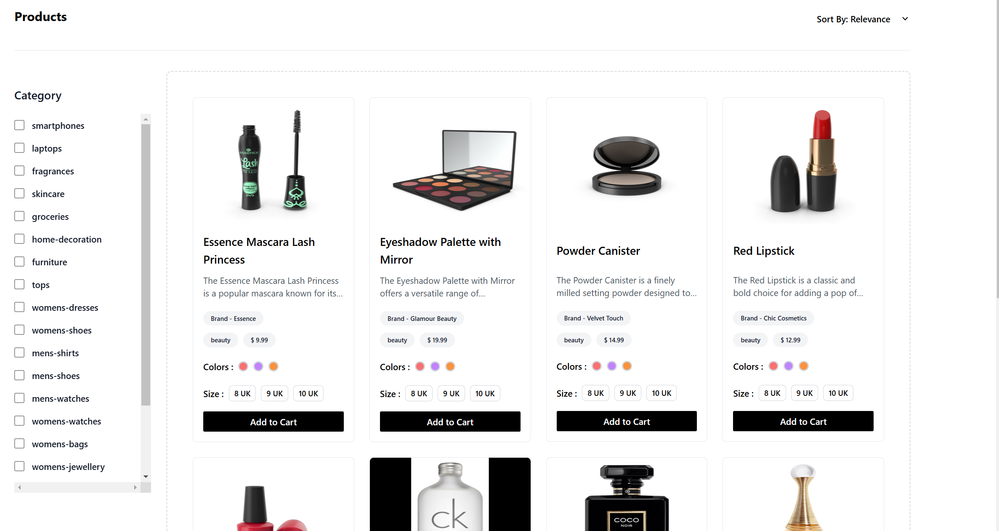
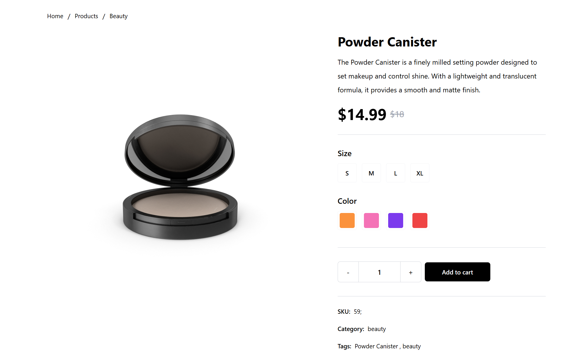

# UrbanCart 🛒

**🌐 [Live Demo](https://urbancart-ajvq.onrender.com/)**

UrbanCart is a modern online shopping platform built with React and Firebase. It offers a smooth shopping experience with a robust cart, secure checkout and user authentication.


---

## 💻 Tech Stack

- **Frontend:** React, React Router, Redux Toolkit, Tailwind CSS, Formik, React Toastify
- **Backend/Services:** Firebase (Authentication & Firestore), Razorpay (Payments), dummyjson API (Products)
- **Build Tools:** Vite, ESLint
- **Deployment:** Docker, Nginx, Render

---

## 🚀 Features

- 🔐 **Authentication**: Login & Signup with Firebase Authentication (including Google sign in)
- 🛒 **Product Display**: Browse and view product details
- 🛒 **Shopping Cart**: Add and remove products
- 💳 **Checkout**: Secure checkout process with Razorpay integration
- 💤 **State Management**: Redux for global state management
- 🔍 **Filtering & Sorting**: Sort and filter products easily
- ✅ **Protected Routes**: Access cart and checkout only when logged in
- 📢 **Toasts & Notifications**: Real-time feedback using `react-toastify`

---

## 📚 Project Structure

```
UrbanCart/
├── public/
├── src/
│   ├── assets/
│   ├── components/
│   ├── firebase/
│   ├── redux/
│   ├── screens/
│   ├── App.jsx
│   ├── main.jsx
├── Dockerfile
├── nginx.conf
├── package.json
├── vite.config.js
└── README.md
```

---

## 🛠️ Installation & Setup

1. **Clone the Repository**
   ```sh
   git clone https://github.com/tchawla827/UrbanCart.git
   cd UrbanCart
   ```
2. **Install Dependencies**
   ```sh
   npm install
   ```
3. **Environment Variables**
   Create a `.env` file and add your Firebase key:
   ```
   VITE_APP_FIREBASE_API_KEY=your_firebase_api_key
   ```
4. **Start the Development Server**
   ```sh
   npm run dev
   ```

---

## 🚀 Deployment

UrbanCart can be deployed easily on **Render**.

### Deploy on Render
1. Push your code to a Git repository.
2. In Render, click **New Web Service** and choose **Static Site**.
3. Connect your repository and configure the following settings:
   - **Build Command:** `npm run build`
   - **Publish Directory:** `dist/`
4. Add the required environment variable in the **Environment** section:
   - `VITE_APP_FIREBASE_API_KEY`
5. Commit a `static.json` file at the project root so Render can rewrite all requests to `index.html`:
   ```json
   {
     "redirects": [
       { "source": "/*", "destination": "/index.html", "statusCode": 200 }
     ]
   }
   ```
6. Click **Create Web Service**. Render will build and deploy your static site automatically.

### Docker
To build and run the project using Docker:
```sh
docker build -t urbancart .
docker run -p 3000:80 urbancart
```
The Docker image ships with a custom **nginx** configuration (`nginx.conf`) that redirects all unknown paths to `index.html` so React Router can handle client-side routes even after refreshing the page.

---

## 📸 Screenshots

### Home Page


### Product Details Page


---

## 🤖 Usage

- **Development:** `npm run dev` – start a local dev server.
- **Production build:** `npm run build` – generate optimized files in `dist/`.
- **Preview build:** `npm run preview` – serve the production build locally.
- **Docker:** `docker build -t urbancart .` then `docker run -p 3000:80 urbancart`.

---

## 🤝 Contributing

Contributions are welcome! Feel free to open issues or submit pull requests to improve UrbanCart.

---

## 📄 License

No license file is present. All rights reserved by the author.

---

## 🙏 Credits

- [dummyjson](https://dummyjson.com/) for product data.
- [Razorpay](https://razorpay.com/) for payment processing.
- [Firebase](https://firebase.google.com/) for authentication and hosting services.

---

## Author
**Tavish Chawla**  
✉️ [tchawla827@gmail.com](mailto:tchawla827@gmail.com)
